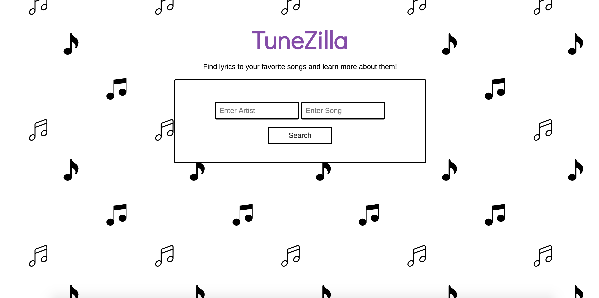
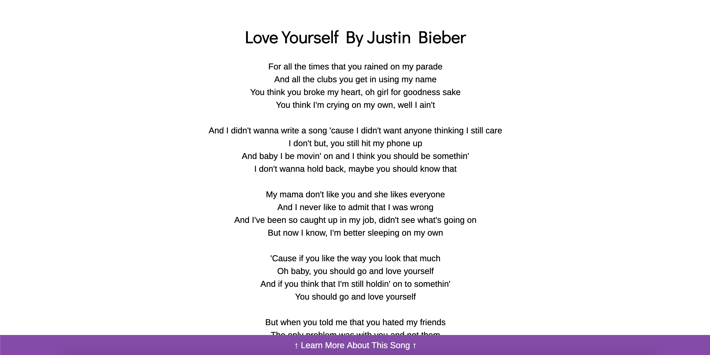
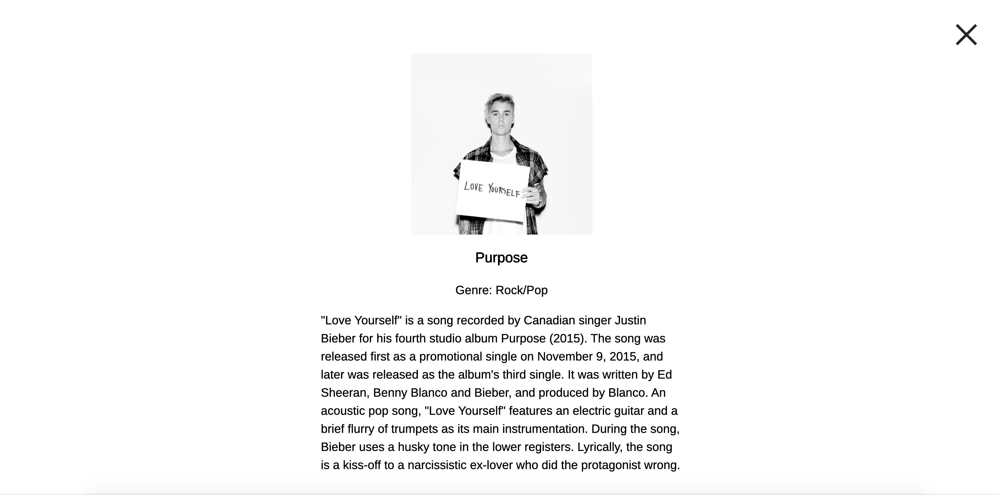

# TuneZilla

A simplistic lyric-fetching web app that optionally provides background and historical information about your favorite songs.

## Motivation

We wanted a website that can easily serve our favorite songs to sing and shout while also learning more about the song without having to open a boring Wikipedia page.

## Recommended Usage

Due to the limitations of some API's available, some results may vary based on the song inputted. For example, it is a known issue that there may not be any available background information on some newer or lesser-known songs. For testing purposes, we recommend you test our web app with Justin Bieber's "Love Yourself."

## Screenshots
Landing Page:

Lyrics:

Background Information:

## Built With

* HTML5
* CSS3
* Javascript
* jQuery

## Demo

- [Live Demo](https://dannydi12.github.io/tunezilla/)

## Authors

* **Daniel DiVenere** - Front-End developmen/styling
* **Rupali Rajput** - Front-End development/styling
